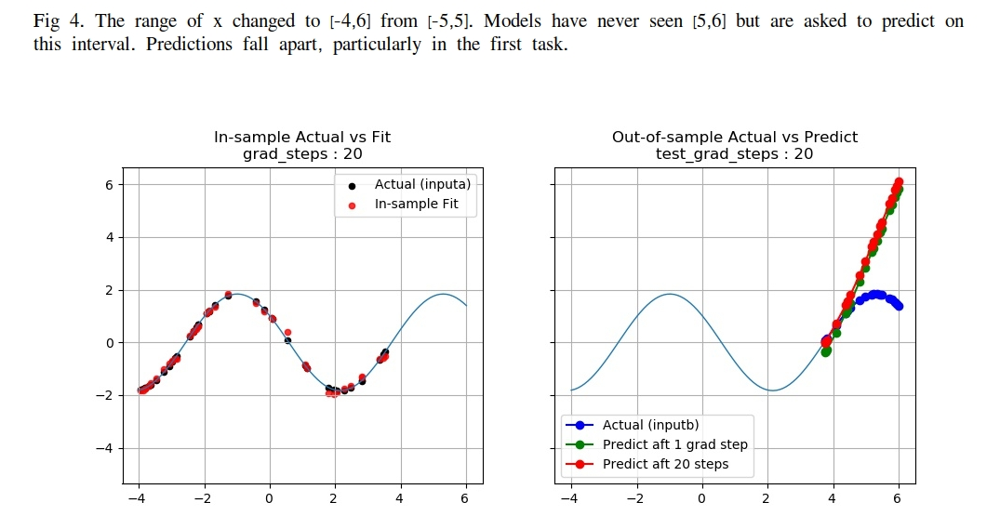
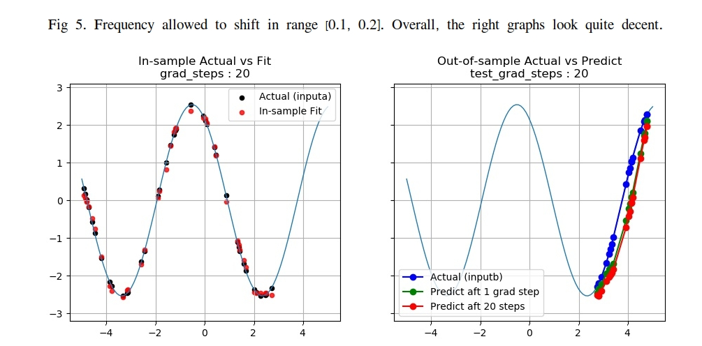
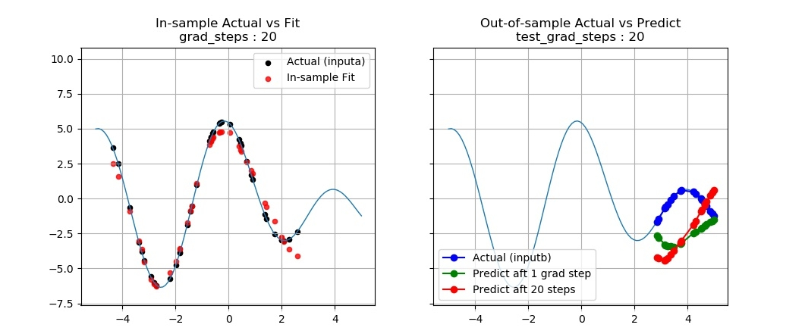

# Reproducing MAML

This is an attempt to reproduce the results in the MAML paper of [Finn et al (2017)[1]](https://arxiv.org/abs/1703.03400), the need of which is explained in [2]. *Maml* is a meta-learning algorithm that learns to generalize from the experience of learning. 

The basic premise of the paper is that parameter initialization has important influence over model learning. A good initialization makes it possible for rapid adaptation and generalization. *Maml* uses the standard technique of gradient descent. But instead of descending onto an optimal parameter for a neural network, it uses gradient decent to find some *common* starting point for a pool of models to begin their individual gradient descent learning.

My key finding is that under a specific data setting, their supervised regression result is reproducible. However, I found that *maml* deteriorates quickly as the training data deviates from the standard form. It seems unable to extend its excellent performance to certain common periodic functions, a disappointing conclusion but it's **not** unexpected. And I'll speculate the reasons that this is so.

## Introduction

*Maml*, short for Model-Agnostic Meta-Learning, falls in the category of K-shot learning where K, the number of available examples, is usually no more than 20. The motivation comes from the fact that any two-year old could recognize a giraffe after seeing a few examples, in contrast with the many deep learning models training on millions of data points just to do as well as a new-born human. 

The challenge is of course how to make use of so little information to generalize out to the vast unknown. Most of the papers in this area make one key assumption :

&nbsp;&nbsp;&nbsp;&nbsp;&nbsp;&nbsp;&nbsp;&nbsp;&nbsp;&nbsp;__although data is sparse, problems are abundant__

This is crucial because if we have enough problems of a similar nature, and on each problem we have a tiny little dataset, then we could gain insights into the overall learning pattern. Using this pattern, we could generalize to solve any other problem that we've only seen a few examples of. 

Interested reader should dive into this excellent paper, and I will skip the technicality here, except for the following observations.

1. The *maml* model is not a model on data, but a model on the starting parameter values of a pool of models, thus the term *meta*.

2. The objective of the algorithm is the sum of the losses on all the tasks that is fed into *maml* collectively, . 

So, by optimizing on this total loss, we're effectively finding out what's the best characteristics for all the models to share on a given task distribution. As I'm only interested in supervised regression here, the loss is just MSE in this experiment. 

3. The goal is to minimize this collective loss as a function of the initial parameter values of the neural network, which could be considered as a meta-parameter of the algorithm, or 

Notice the minimization is over the initial parameters before taking the first gradient step in the inner loop, i.e the \theta without subscript.

## Reproduction Methodology

To reproduce a published result, it's not enough to just run the github code on a given datasets. An algorithm must be judged on an out-of-sample basis, ie. it must demonstrate its ability to generalize. In the case of meta-learning, this requirement has implication on two levels. First, with high probability, *maml* needs to give birth to a model that does well on a test set that it wasn't trained on. Secondly, it must be able to learn as rapidly and stay as fit on tasks drawn from a sufficiently large portion of the meta distribution. So, to succeed as a meta-learning algorithm, I want to demonstrate that 1) a large fraction of the resultant models have good out-of-sample performance, 2) the model learning remains robust to slight perturbation in the meta distribution. 

To demonstrate 1), I will show the out-of-sample prediction of the models learned from the same task generator. For 2), I introduce slight deviations in the functional shape and show the result on the models' out-of-sample performance.

Similar to an ablation study[3], I want to poke around the neighborhood of the meta space to identify  regimes where the model, in this case the meta-model is sensitive to the distribution of tasks and how far I could go before learning fails.

## Data
I made some modifications to their data generator to include a variety of functional shapes (see `FunGenerator.py`). First, as a natural extension I introduce an angular frequency to the sine function, ie. f(x) = a`*`sin(w`*`x+ph). Two other simple varieties are added, namely, sum of a sine and cosine, product of sine and cosine. Think of them as the first few terms in a Fourier series. No big deal.

The meta distribution, or the task distribution is based on sampling from the parameters of these functions within some predefined range, just like in their paper. 

I also included a special function to test the algorithm, namely, a straight line. I will discuss the surprising result in the next section. 

To examine *maml's* out-of-sample performance, I adopt the following convention from time series modeling. Treating the data as a time sequence, I divide a random draw from the meta distribution into a training, a validation, and a test set. The train and validation set will be randomly selected from the first 80% of the time steps, while the last 20% is used as test. Thus, the train and validation set overlaps, but the test set does not. 

The intention is to let the model learn any periodicity it could find in the combination of train and validation set. But the model is not allowed see into the "future", which is the test set.

Once a meta-model is learned, I use it to produce a model to predict on the test set. And that will be the out-of-sample performance measure.

## Results

## Some Thoughts

## Conclusion

## Code
The code is taken from this [repo](https://github.com/cbfinn/maml). 

### Dependencies
Code has been tested on 
* python 3.7.3
* TensorFlow v1.13.1

### Usage
To run the code, see the usage instructions at the top of `Main.py`.

### Contact
To ask questions or report issues, please open an issue on the [issues tracker](https://github.com/htso/maml_reproduction/issues).

References

[1] Finn, C., Abbeel, P., & Levine, S. (2017, August). Model-agnostic meta-learning for fast adaptation of deep networks. In Proceedings of the 34th International Conference on Machine Learning-Volume 70 (pp. 1126-1135). JMLR. org.

[2]"Is There a Reproducibility Crisis in Science?". Nature [Video](https://www.scientificamerican.com/video/is-there-a-reproducibility-crisis-in-science/), Scientific American. 28 May 2016. 

[3] https://twitter.com/fchollet/status/1012721582148550662?lang=en

