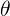
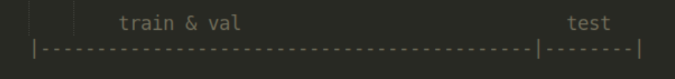
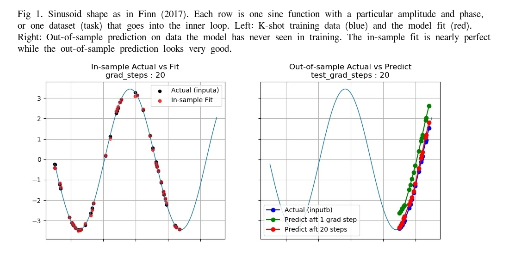
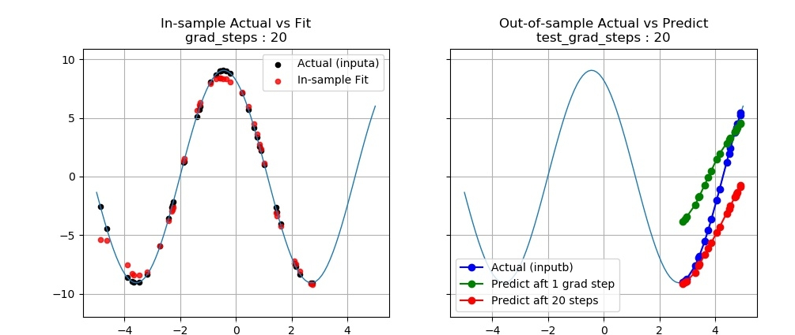
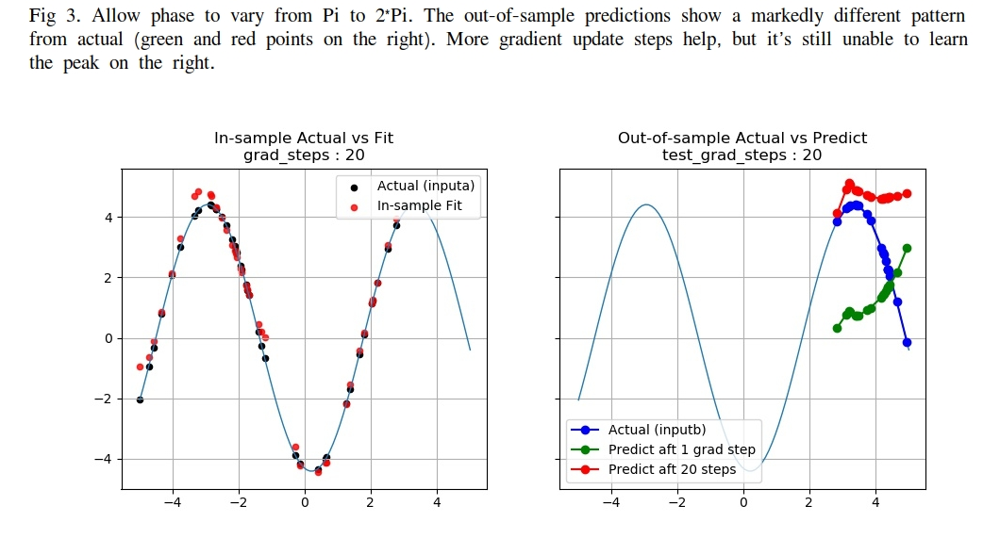
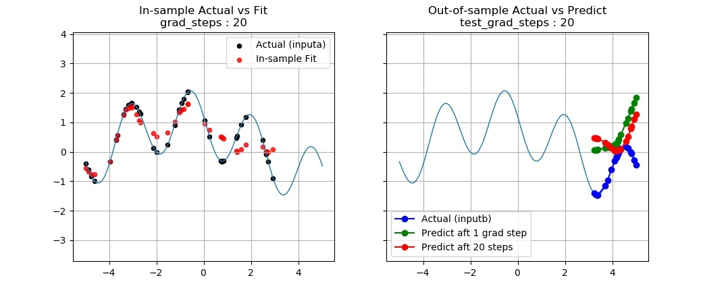

# Reproducing MAML
This is an attempt to reproduce the results in the *MAML* paper of [Finn et al (2017)[1]](https://arxiv.org/abs/1703.03400), the need of which is explained in [2]. *Maml* is a meta-learning algorithm that learns to generalize from the experience of learning. 

The basic premise of the paper is that parameter initialization has important influence over model learning. A good initialization makes it possible for rapid adaptation and generalization. *Maml* uses the technique of gradient descent. Instead of descending onto an optimal parameter for a neural network, it uses gradient descent to find some *common* starting point for a pool of models to begin their individual gradient descent learning.

My key finding is that under a specific data setting, their supervised regression result is reproducible. However, I found that *maml* deteriorates quickly as the training data deviates from the standard form. It seems unable to extend its excellent performance to certain common periodic functions, a disappointing conclusion but it's **not** unexpected. And I'll explain the reasons that this is so.

### Introduction
*Maml*, short for Model-Agnostic Meta-Learning, falls in the category of K-shot learning where K, the number of available examples, is usually no more than 20. The motivation comes from the fact that any two-year old baby could recognize a giraffe after seeing one or two examples, in contrast with the many deep learning models training on millions of data points just to do as well as a new-born human. 

The challenge is of course how to make use of so little information to generalize out to the vast unknown. Most papers in this area rely on one key assumption :

&nbsp;&nbsp;&nbsp;&nbsp;&nbsp;&nbsp;&nbsp;&nbsp;&nbsp;&nbsp;__although data is sparse, problems are abundant.__

This is crucial because if we have enough problems of a similar nature, and on each problem we have a tiny little dataset, we could then gain insights into the overall learning pattern. Based on this pattern, we could generalize to solve any other problem that we've only seen a few examples of. 

Interested reader should dive into this excellent paper, and I will skip the technicality here, except for the following observations.

1. The *maml* model is not a model on data, but a model on the starting parameter values of a pool of models, thus the term *meta*.

2. The objective of the algorithm is the sum of the losses on all the tasks that are fed into *maml* collectively, . 

So, by optimizing on this total loss, we're effectively finding out what's the best characteristics for all the models to share on a given task distribution. As I'm only interested in supervised regression here, the loss is just MSE here. 

3. The goal is to minimize this collective loss as a function of the initial parameter values of the neural network, which could be considered as a meta-parameter of the algorithm, or 

Notice the minimization is over the initial parameter vector  (no subscript) before taking the first gradient step in the inner loop.

### Reproduction Methodology
To reproduce a published result, it's not enough to just run the code on the same datasets that the authors have investigated. An algorithm must be judged on an out-of-sample basis, ie. it must demonstrate its ability to generalize. 

Standard modeling procedure in machine learning requires that a test data set be kept in isolation from the training and validation set. After model building is completed, it is evaluated on the final model to come up with a measure of its generalization capability.   

In the case of meta-learning, the assessment is not to be made on individual models, but on the collective whole that falls out of the learning algorithm. The test set in this case is not some part of a dataset, but a number of _complete datasets_ that the meta-learning procedure has never seen during training. 

This requirement has implications on two levels. First, with high probability, *maml* needs to give birth to a model that does well on a test set that it wasn't trained on. Secondly, it must be able to learn as rapidly and stay as fit on tasks drawn from a sufficiently large portion of the meta distribution. So, to succeed as a meta-learning algorithm, I want to demonstrate that 1) a large fraction of the resultant models have good out-of-sample performance, 2) the model learning remains robust to slight perturbation in the meta distribution. 

To demonstrate 1), I will show the out-of-sample prediction of the models learned from the same task generator. For 2), I introduce slight deviations in the functional shape and show the result on the models' out-of-sample performance.

Similar to an ablation study[3], I want to poke around the neighborhood of the meta space to identify region where the model, in this case the meta-model is sensitive to the distribution of tasks and how far I could go before learning fails.

### Test procedure in details
An important control parameter is the range of x, since this is the input in the neural nets. The value of x is fixed in a range, so that every dataset generated during meta training comes from this set range. For example, the sine function in said paper is evaluated between -5 and 5. The K shots for training and the K shots for validation are randomly picked in this range. 

During meta test phase, I divide this range into a train portion and a test portion. For example, a model is trained on data from -5 to 3, then tested on x in [3,5]. This is the first degree of meta-testing.

A more rigorous assessment of the generalization capability would be as follow. All models trained during meta-leraning phase are based on x in [-5,5]. For testing, new data are drawn from [5, 10] for the same data generator, and the trained models are evaluated on this new range.

### Data
I made some modifications to their data generator to include a variety of functional shapes (see `FunGenerator.py`). First, as a natural extension I introduce an angular frequency to the sine function, ie. f(x) = a`*`sin(w`*`x+ph). Two other simple varieties are added, namely, sum of a sine and cosine, product of sine and cosine. Think of them as the first few terms in a Fourier series. No big deal.

The meta distribution, or the task distribution is based on sampling from the parameters of these functions within some predefined range, just like in their paper. 

I also included a special function to test the algorithm, namely, a straight line. I will discuss the surprising result in the next section. 

To examine *maml's* out-of-sample performance, I adopt the following convention from time series modeling. Treating the data as a time sequence, I divide a random draw from the meta distribution into a training, a validation, and a test set. The train and validation set will be randomly selected from the first 80% of the time steps, while the last 20% is used as test. Thus, the train and validation set overlaps, but the test set does not. 

The intention is to let the model learn any periodicity it could find in the combination of train and validation set. But the model is not allowed see into the "future", which is the test set.

Once a meta-model is learned, I use it to produce a model to predict on the test set. And that will be the out-of-sample performance measure.

### Results
Since the data are 2D functions, the best assessment is by visualization and that's exactly what I have below. 

This first graph (Fig 1) is Finn's regression problem with identical parameters. The amplitude and phase of the sine are allowed to vary between [1.0, 5.0] and [0, pi], respectively. I set the number of gradient update steps (`num_updates`) to 20, just to be generous -- the paper has 1 and 10. The graph on the left shows the actual data used in training (black points) and the fit (red). The right graph shows the predictions on the test set that it has never seen in training, after taking one and 20 gradient steps. The K-shot learned neural net is able to predict the upturn in the sine wave. It also shows that 20 gradient steps is better than one. So, overall, excellent result.

In Fig 2, I allow the amplitude to span a wider range, from 0.1 to 10. The out-of-sample predictions start to deteriorate (right graph). But overall, it still knows the function is upward sloping in the test range. 

Next in Fig 3, phase is allowed to vary from Pi to 2`*`Pi. The out-of-sample predictions show a markedly different pattern from actual. More gradient updates help a little bit, but it's still unable to figure out that the peak in the sine function occurs at around 3.7.

In Fig 6 is a more challenging functional shape, a superposition of sine and cosine, which is still periodic. The test predictions bear no resemblance to actual regardless of the number of gradient updates.

### Some Final Thoughts
To assess the merit of a meta-learning algorithm, some careful analysis is needed. When a deep net fails to learn, a number of factors might be at play. The typical problems are 1) the model is either overfitted or underfitted due to too much or not enough capacity, 2) hyperparameters not properly tuned, 3) the wrong architecture is used. 

A meta learning algorithm may fail for a different set of reasons. Possible attribution include 

1. the learning procedure fails to capture the common characteristics in the task distribution; in this case, the optimal initialization doesn't provide sufficient inductive bias to learn in the K-shot regime, 

2. the underlying model architecture is not appropriate for few shot learning of the specific task type, 

3. with high probability, the few steps of gradient decent converge to a bad local optimum.  

I'll leave a detailed analysis to a separate blog. 

### Code
The code is taken from this [repo](https://github.com/cbfinn/maml). 

### Dependencies
Code has been tested on 
* python 3.7.3
* TensorFlow v1.13.1
* CUDA 10.1
* Ubuntu 18.04 

### Usage
To reproduce the results, see instructions at the top of `Main.py`.

### Contact
To ask questions or report issues, please open an issue on the [issues tracker](https://github.com/htso/maml_reproduction/issues).

References

[1] Finn, C., Abbeel, P., & Levine, S. (2017, August). Model-agnostic meta-learning for fast adaptation of deep networks. In Proceedings of the 34th International Conference on Machine Learning-Volume 70 (pp. 1126-1135). JMLR. org.

[2]"Is There a Reproducibility Crisis in Science?". Nature [Video](https://www.scientificamerican.com/video/is-there-a-reproducibility-crisis-in-science/), Scientific American. 28 May 2016. 

[3] https://twitter.com/fchollet/status/1012721582148550662?lang=en

